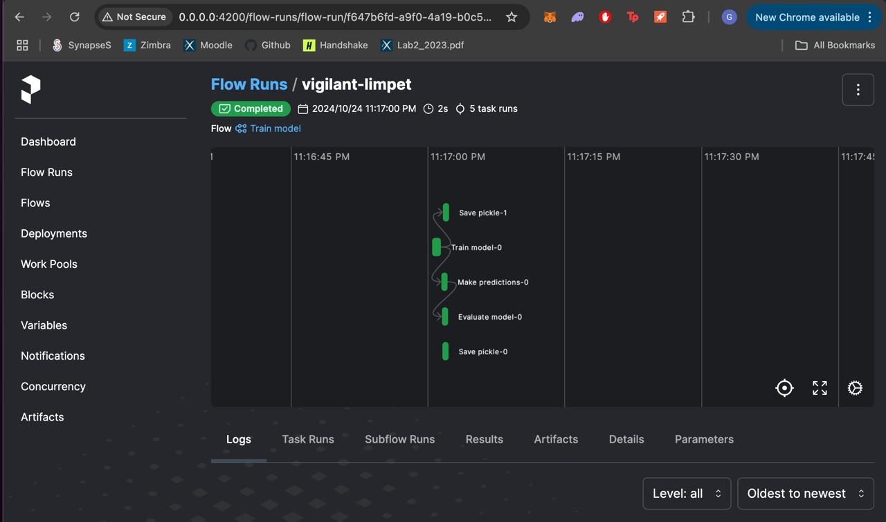
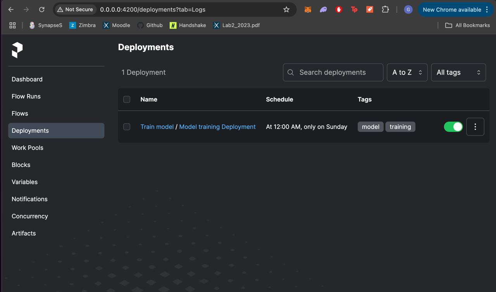

<div align="center">

# xhec-mlops-project-student

[]()

[](https://github.com/psf/black)

[](https://pycqa.github.io/isort/)
[](https://github.com/PyCQA/flake8)
[](https://github.com/artefactory/xhec-mlops-project-student/blob/main/.pre-commit-config.yaml)
</div>

## Contributors

| Name                     | Email                                      |
|--------------------------|--------------------------------------------|
| [Jules Crevola](mailto:julescrevola@email.com)       | julescrevola@email.com           |
| [Ghali Chraibi](mailto:ghali.chraibi@polytechnique.edu) | ghali.chraibi@polytechnique.edu  |
| [Carlo Antonio Patti](mailto:carlopatti1@gmail.com)  | carlopatti1@gmail.com            |
| [Mohamed Benslimane](mailto:benslimane15.mohamed@gmail.com) | benslimane15.mohamed@gmail.com   |
| [Antonio Roberto Ventura](mailto:antonio.ventu@hotmail.com) | antonio.ventu@hotmail.com        |

## Description

This repository has for purpose to industrialize the [Abalone age prediction](https://www.kaggle.com/datasets/rodolfomendes/abalone-dataset) Kaggle contest.

<details>
<summary>Details on the Abalone Dataset</summary>

The age of abalone is determined by cutting the shell through the cone, staining it, and counting the number of rings through a microscope -- a boring and time-consuming task. Other measurements, which are easier to obtain, are used to predict the age.

**Goal**: predict the age of abalone (column "Rings") from physical measurements ("Shell weight", "Diameter", etc...)

You can download the dataset on the [Kaggle page](https://www.kaggle.com/datasets/rodolfomendes/abalone-dataset)

</details>

# Environment Setup

This section outlines the steps to set up the Python environment for this project.

## Prerequisites
Ensure you have the following installed:
- **Python 3.x**
- **pip** (Python package installer)
- (Optional) **conda** (if you are using it to manage environments)
- **pre-commit** (for running pre-commit hooks)

## Setup Instructions

### 1. Clone the Repository

First, clone the repository to your local machine:

```bash
git clone https://github.com/julescrevola/xhec-mlops-project-student
cd <repository-directory>
```

### 2. Set Up the Python Environment

**Using conda**

- Install the app dependencies by running the following command:
```bash
pip-compile requirements.in
```

- If you are contributing to the development of this project, install the development dependencies:
```bash
pip-compile requirements-dev.in
```

- If you're using conda, create and activate a new environment from the environment.yml
```bash
conda env create -f environment.yml
conda activate <env_name>
```

- If you need to update the environment after having compiled the requirements with new packages, you can run
```bash
conda env update -f environment.yml --prune
conda activate <env_name>
```

**Option for dev-only: Setup Pre-commit Hooks**

To ensure code quality and enforce coding standards, the project uses pre-commit hooks:

Install the pre-commit hooks defined in ```pre-commit-config.yaml```
```bash
pre-commit install
```

### 3. Downloading the Dataset
To download the dataset for this project, you will need to use the opendatasets library. Follow these steps:

**Kaggle Account:**

You must have a Kaggle account. If you don’t have one, you can sign up at Kaggle. When running the code for the first time in order to retrieve the data, you'll have to input your Kaggle username and your password.

### 4. Run the Prefect UI & Worflow

**1: Configure the Prefect API and start the Prefect server**

```bash
prefect config set PREFECT_API_URL=http://0.0.0.0:4200/api
prefect server start --host 0.0.0.0
```
Make sure the server is running and accessible.

**2: Create the Flow**

Once the server is up and running, navigate to the src/modelling directory and ensure you have activated the correct environment.

Now, create the flow by running the following:
```bash
python workflow.py
```



**3: Deploy or Schedule the Flow**

The flow will be deployed and ran automatically each Sunday at Midnight
```bash
python deployment.py
```


